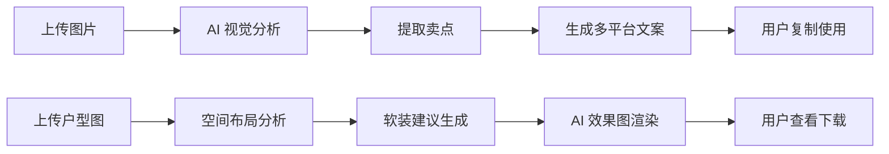

# 🏠 RealState AI 产品需求文档 (PRD)
> **房产文案大师** - 让每套房子都会讲故事  
> 版本：V1.0 MVP | 日期：2024-12-14 | 状态：已确认

---

## 一、产品概述

### 1.1 核心目标 (Mission)
通过 AI 视觉分析，帮助房产从业者（中介、房东、销售）将房源照片/户型图自动转化为多平台适配的专业文案，并生成 AI 效果图，大幅提升房源展示效率与吸引力。

### 1.2 用户画像 (Persona)

| 用户类型 | 典型场景 | 核心痛点 |
|---------|---------|---------|
| 房产中介 | 收房后需快速发布房源 | 不擅长写文案，容易忽略卖点细节 |
| 民宿房东 | 在小红书/美团推广房源 | 不知道如何用感性语言吸引租客 |
| 售楼处销售 | 朋友圈营销新盘户型 | 缺乏创意描述空间改造潜力 |

---

## 二、MVP 功能范围

### 2.1 功能 A：图片生爆款文案 + 卖点挖掘

| 功能项 | 描述 |
|-------|------|
| 📸 图片上传 | 支持 1-9 张房间照片上传 |
| 📝 基本信息 | 户型、面积、小区名、价格、亮点标签 |
| 🤖 AI 视觉分析 | 识别材质类型、采光、空间特征 |
| 📋 卖点清单 | 自动生成 5 个核心卖点 + 销售话术 |
| ✍️ 多平台文案 | 贝壳版 / 小红书版 / 朋友圈版 |
| 📋 一键复制 | 快速复制到剪贴板 |

### 2.2 功能 B：户型图分析与软装叙事

| 功能项 | 描述 |
|-------|------|
| 🏗️ 户型图上传 | 支持手机拍照的户型图 |
| 🔍 智能识别 | 自动识别图片类型，无法识别时手动选择 |
| 📐 空间分析 | 识别墙体布局，判断空间潜力与缺陷 |
| 🛋️ 软装建议 | 纯文字改造建议 |
| 🎭 风格化剧本 | 独居青年 / 新婚夫妻 / 三口之家 |
| 🎨 AI 效果图 | 调用 AI 生图模型生成优化场景效果图 |

### 2.3 用户系统与积分

| 功能项 | 描述 |
|-------|------|
| 👤 用户注册/登录 | 手机号或微信登录 |
| 🎫 卡密兑换 | 用户输入卡密兑换积分 |
| 💰 积分消耗 | 图片生文案 10 积分 / 户型分析 15 积分 |
| 📊 积分余额 | 实时显示剩余积分 |
| 🔧 后台管理 | 管理员生成/管理卡密 |

---

## 三、UI 设计方案

**选定方案：A - 标签页式单页应用**

```
┌─────────────────────────────────────────────────────────┐
│  🏠 RealState AI                      💰 积分: 150  👤  │
├─────────────────────────────────────────────────────────┤
│  ┌──────────────┐  ┌──────────────┐                     │
│  │ 📸 图片生文案 │  │ 🏗️ 户型分析  │    ← 主功能标签    │
│  └──────────────┘  └──────────────┘                     │
├─────────────────────────────────────────────────────────┤
│   ┌─────────┬─────────┬─────────┐                       │
│   │  📷+    │  📷+    │  📷+    │    ← 点击上传图片     │
│   └─────────┴─────────┴─────────┘                       │
│   ┌─────────────────────────────────────────────────┐   │
│   │ 户型  [2室1厅 ▼]    面积  [____] 平米           │   │
│   │ 小区  [______________]   价格  [____] 万        │   │
│   │ 亮点  [地铁近] [学区房] [朝南] [精装修] [+添加]  │   │
│   └─────────────────────────────────────────────────┘   │
│           ┌─────────────────────────┐                   │
│           │   ✨ 开始生成 (消耗10积分)│                   │
│           └─────────────────────────┘                   │
├─────────────────────────────────────────────────────────┤
│  📊 AI 分析结果                                         │
│  ┌─────────────────────────────────────────────────┐   │
│  │ 🎯 核心卖点: 全明户型 | 大理石台面 | 干湿分离    │   │
│  └─────────────────────────────────────────────────┘   │
│  ┌─────────────┐ ┌─────────────┐ ┌─────────────┐       │
│  │   贝壳版    │ │  小红书版   │ │  朋友圈版   │       │
│  └─────────────┘ └─────────────┘ └─────────────┘       │
│  ┌─────────────────────────────────────────────────┐   │
│  │ 文案内容...                   [📋 一键复制]     │   │
│  └─────────────────────────────────────────────────┘   │
└─────────────────────────────────────────────────────────┘
```

**视觉风格**：深灰/墨蓝主调 + 渐变金色点缀 + 毛玻璃效果

---

## 四、业务规则

### 4.1 积分系统
| 规则 | 说明 |
|-----|------|
| 卡密格式 | 16 位字母数字，一次性使用 |
| 积分有效期 | 永久有效 |
| 新用户福利 | 注册即送 20 积分 |

### 4.2 文案生成
| 平台 | 风格 | 字数 |
|-----|------|-----|
| 贝壳 | 专业规范 | 300-500 字 |
| 小红书 | 感性+Emoji | 200-400 字 |
| 朋友圈 | 简洁亮点 | 100-200 字 |

---

## 五、技术架构

| 层级 | 技术 |
|-----|------|
| 前端 | Next.js 14 + Zustand |
| 后端 | Node.js + Express |
| 数据库 | **Supabase (PostgreSQL + Auth + Storage)** |
| 缓存 | Supabase 内置或 Redis (可选) |
| AI 分析 | Gemini Vision + Gemini Pro |
| AI 生图 | Gemini 2.5 Flash (优先) / SeeDream (备选) |
| 文件存储 | Supabase Storage |

> **💡 AI 生图策略**: 采用多 API 降级方案，优先使用 Gemini 2.5 Flash Image (Sydney-AI)，失败时降级到火山引擎 SeeDream，两者均失败则返回文字描述 + 参考图

> **🎯 Supabase 优势**:
> - 内置用户认证（手机号/微信登录）
> - 内置文件存储（替代阿里云 OSS）
> - 实时数据库功能
> - 自动生成 REST API
> - Row Level Security (RLS) 保护数据安全

### 5.2 核心流程



### 5.3 数据模型

```sql
-- 用户表
users (id, phone, nickname, points, created_at)

-- 卡密表
redeem_codes (id, code, points, is_used, used_by, created_at)

-- 生成记录表
generations (id, user_id, type, input_images, output_content, points_cost)
```

---

## 六、版本规划

| 版本 | 功能 | 状态 |
|-----|------|-----|
| **V1 MVP** | 图片生文案 + 户型分析 + AI效果图 + 积分系统 | 🎯 当前 |
| V2 | 国际化 (Zillow/Instagram) + 品牌识别 | 计划中 |
| V3 | 批量处理 + 历史记录 + 多平台发布 | 计划中 |

---

## 七、风险评估

| 风险 | 级别 | 应对策略 |
|-----|-----|---------|
| AI 生图质量不稳定 | 🔴 高 | 精调 Prompt + 多张选择 + 重新生成 |
| Vision 识别偏差 | 🟡 中 | 图片质量提示 + 手动修正 |
| API 成本 | 🟡 中 | 合理积分定价 + 使用监控 |

---

> ✅ **本文档已确认** - 2024-12-14  
> 📎 关联文档：[产品路线图](product_roadmap.md) | [MVP原型图](mvp_prototypes.md) | [架构蓝图](architecture_blueprint.md)
